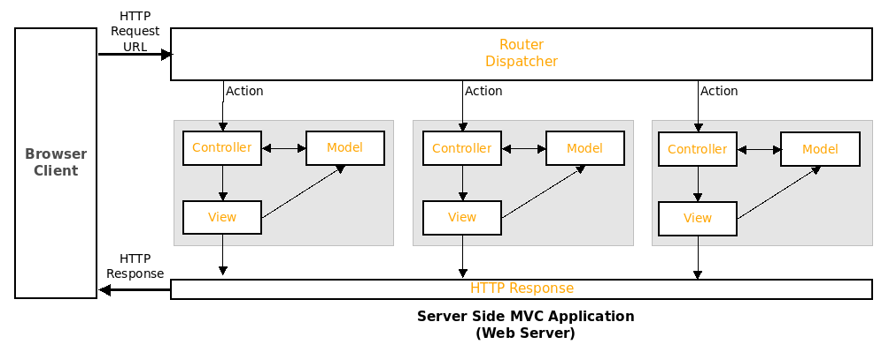

[](https://classroom.github.com/a/v_D1I1ra)
## CS 2033 Web Systems - Assignment Four (S24)



Make the following changes to the provided MVC Framework application.

Run the following script to create your database.
```
sudo mysql < assign4.sql
```

1. **Model:**
   - Implement the **ArticleDAO Model** for the **articles** table. *The DAO should implement all of the CRUD functions for the articles table.*

2. **View:**
   - Implement the View to *display the articles* on the **Home page for viewers to read the articles like on a website (Not a Table)
   - Implement the View (Add Form) to add an article to the articles table.
   
3. **Controller:**
   - Modify the Home Controller to display the articles on the Home page
   - Add the Controller to Add an Article using the view(Add Form)
   - Add the Add Article option to the main menu
   
4. **Security:**
   - Modify your Security Authentication and Authorization Scheme to allow the following roles: **user, admin, and author**
   - The ability to Add a New Article is only available to authenticated users with the **author** role
   - Access to the Users Admin View is restricted to authenticated users with the **amin** role.

Ensure your works properly by accessing your site using accoutns with all of the roles, and cheching that proper security is implemented.

### Assessment Rubric

| Criteria            | Unsatisfactory (0-49) | Needs Improvement (50-69) | Satisfactory (70-89) | Excellent (90-100) |
|---------------------|------------------------|---------------------------|-----------------------|---------------------|
| Model Implementation| - DAO lacks some or all CRUD functions for the articles table. | - DAO implements CRUD functions, but some are incomplete or have errors. | - DAO successfully implements CRUD functions for the articles table. | - DAO implements CRUD functions with proper error handling and efficiency. |
| View Implementation | - View for displaying articles is not implemented or incomplete. | - View for displaying articles is implemented but lacks proper design or functionality. | - View for displaying articles is implemented with proper design and functionality. | - View for displaying articles is well-designed, user-friendly, and responsive. |
|                     | - View for adding articles is not implemented or incomplete. | - View for adding articles is implemented but lacks proper validation or user guidance. | - View for adding articles is implemented with proper validation and user guidance. | - View for adding articles is intuitive, visually appealing, and error-free. |
| Controller          | - Home Controller lacks modification for displaying articles. | - Home Controller displays articles but lacks proper integration or functionality. | - Home Controller successfully displays articles with proper integration and functionality. | - Home Controller is well-organized, efficient, and effectively handles article display. |
|                     | - Controller for adding articles is not implemented or incomplete. | - Controller for adding articles is implemented but lacks proper authentication or authorization. | - Controller for adding articles is implemented with proper authentication and authorization. | - Controller for adding articles is secure, follows best practices, and handles edge cases. |
|                     | - Main menu does not include an option to add articles. | - Main menu includes an option to add articles but lacks proper functionality. | - Main menu includes a functional option to add articles. | - Main menu is well-designed, user-friendly, and integrates seamlessly with the application. |
| Security            | - Security scheme is not modified or lacks implementation. | - Security scheme is modified but lacks proper role-based access control. | - Security scheme successfully implements role-based access control for user, admin, and author roles. | - Security scheme is robust, comprehensive, and effectively restricts access based on roles. |
|                     | - Authentication for adding new articles is not implemented or incomplete. | - Authentication for adding new articles is implemented but lacks proper validation or error handling. | - Authentication for adding new articles is implemented with proper validation and error handling. | - Authentication for adding new articles is seamless, secure, and transparent to users. |
|                     | - Authorization for adding new articles is not implemented or incomplete. | - Authorization for adding new articles is implemented but lacks proper role-based restrictions. | - Authorization for adding new articles is implemented with proper role-based restrictions. | - Authorization for adding new articles is granular, customizable, and enforces strict access control. |
